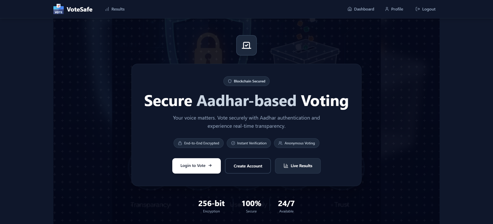
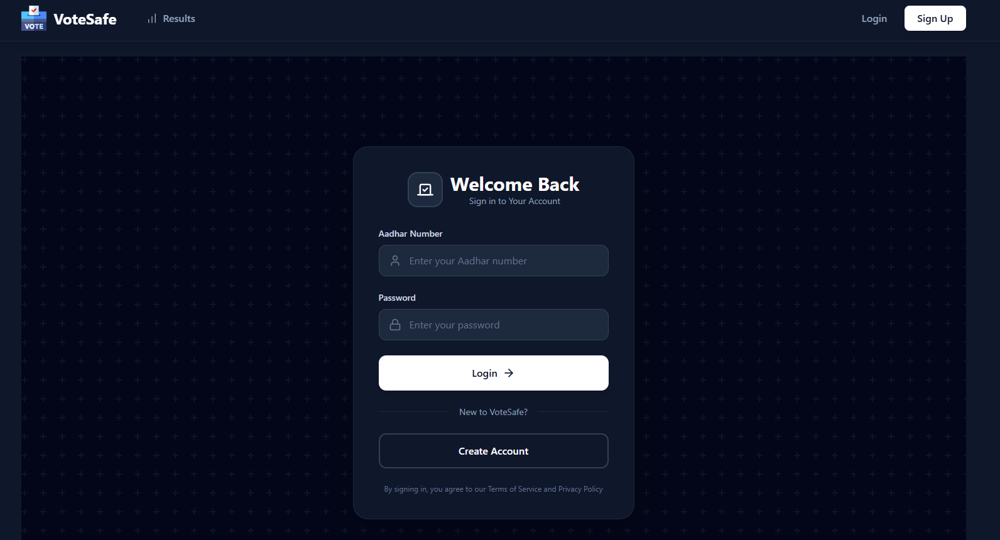
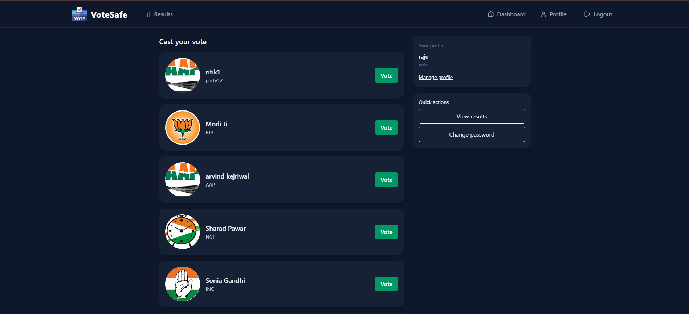
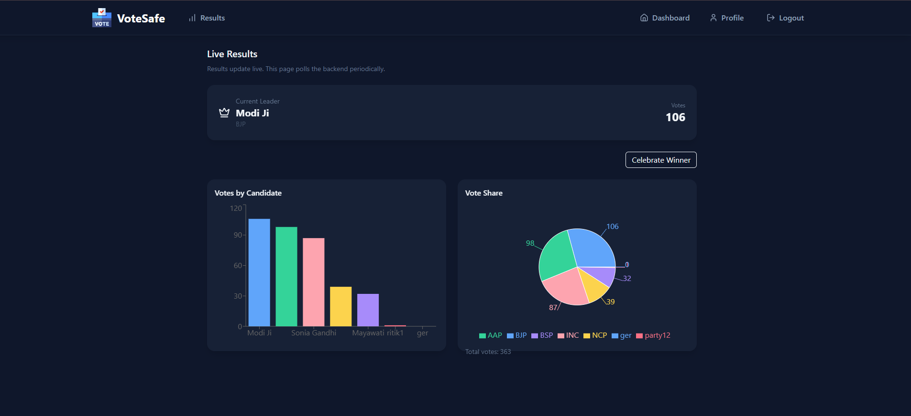
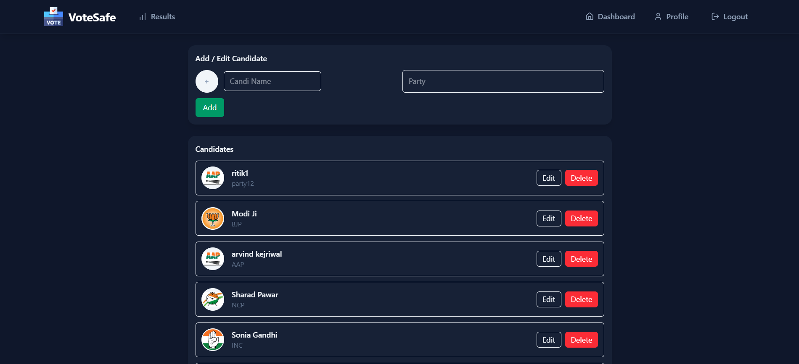

# 🗳️ VoteSafe - Secure Aadhar-based Voting Application

<div align="center">


**A modern, secure voting platform with Aadhar authentication, real-time results, and elegant dark theme UI**

[Features](#-features) • [Screenshots](#-screenshots) • [Setup](#-installation--setup) • [API Docs](#-api-documentation) • [Tech Stack](#-technology-stack)

</div>


---

## 📖 Overview

VoteSafe is a full-stack voting application that enables secure, transparent, and tamper-proof elections. Built with modern web technologies, it uses Aadhar number authentication to ensure one vote per person while maintaining user privacy. The application features a sleek dark theme interface, real-time vote counting, and comprehensive admin controls.

### Why VoteSafe?

- **🔒 Secure**: Aadhar-based authentication with JWT tokens and bcrypt password hashing
- **🎯 One Vote Policy**: Strict enforcement of single vote per user
- **📊 Real-time Results**: Live vote counting with sorted, visual results
- **👑 Admin Control**: Dedicated admin panel for candidate management
- **🎨 Modern UI**: Beautiful dark theme with responsive design
- **☁️ Cloud Ready**: Cloudinary integration for image storage

---

## ✨ Features

### User Features
- ✅ Secure signup and login using Aadhar number + password
- 🔐 JWT-based authentication for protected routes
- 🗳️ Vote once per user with server-side validation
- 👤 User profile management with password change
- 📱 Fully responsive design for all devices
- 🎨 Clean, modern dark theme interface

### Admin Features
- 👑 Single admin account with special privileges
- ➕ Add, edit, and delete candidates
- 📸 Upload candidate photos via Cloudinary
- 📊 View live vote statistics
- 🚫 Admin cannot vote (maintains neutrality)
- 🔧 Complete candidate management dashboard

### Technical Features
- 🔄 Real-time vote counting
- 📊 Sorted results in descending order
- 🛡️ Secure password hashing with bcrypt
- 🎫 Token-based session management
- 🌐 RESTful API architecture
- 💾 MongoDB for persistent data storage

---

## 📸 Screenshots

### Home Page

*Modern landing page with hero section and call-to-action buttons*

### Login Page

*Secure login interface with Aadhar authentication*

### Signup Page

*User registration with Aadhar QR verification and live photo capture*

### Dashboard

*User dashboard showing available candidates and voting interface*

### Results Page

*Live vote counts with visual representation and sorted rankings*

### Admin Panel

*Comprehensive admin dashboard for candidate management*

---

## 🛠️ Technology Stack

### Frontend
| Technology | Purpose |
|------------|---------|
| **React 18** | Modern UI framework with hooks |
| **Vite** | Lightning-fast build tool and dev server |
| **Tailwind CSS** | Utility-first CSS framework |
| **Axios** | HTTP client for API requests |
| **React Router** | Client-side routing |
| **Lucide React** | Beautiful icon library |
| **React Hot Toast** | Elegant toast notifications |
| **React QR Reader** | QR code scanning for Aadhar verification |

### Backend
| Technology | Purpose |
|------------|---------|
| **Node.js** | JavaScript runtime environment |
| **Express 5** | Web application framework |
| **MongoDB** | NoSQL database |
| **Mongoose** | MongoDB object modeling |
| **JWT** | Secure token-based authentication |
| **bcrypt** | Password hashing algorithm |
| **Multer** | File upload middleware |
| **Cloudinary** | Cloud-based image storage |

---

## 📋 Prerequisites

Before you begin, ensure you have the following installed:

- **Node.js** (v18+ recommended)
- **npm** or **yarn**
- **Git**
- **MongoDB** (local installation or Atlas account)
- **Cloudinary account** (for image uploads)

---

## 🚀 Installation & Setup

### 1. Clone the Repository

```bash
git clone https://github.com/Raghavverma109/voting_app.git
cd voting_app
```

### 2. Backend Setup

```bash
cd backend
npm install
```

Create a `.env` file in the `backend/` directory:

```env
# Server Configuration
PORT=5000

# Database
MONGO_URI=your_mongodb_connection_string

# Authentication
JWT_SECRET=your_super_secret_jwt_key

# Cloudinary Configuration
CLOUDINARY_CLOUD_NAME=your_cloudinary_cloud_name
CLOUDINARY_API_KEY=your_cloudinary_api_key
CLOUDINARY_API_SECRET=your_cloudinary_api_secret
```

Start the backend server:

```bash
# Development mode with auto-restart
npm run dev

# or Production mode
npm start
```

The backend will run on `http://localhost:5000`

### 3. Frontend Setup

```bash
cd ../frontend
npm install
```

Create a `.env` file in the `frontend/` directory:

```env
VITE_API_URL=http://localhost:5000
```

Start the frontend development server:

```bash
npm run dev
```

The frontend will run on `http://localhost:5173`

### 4. Access the Application

Open your browser and navigate to:
- **Frontend**: `http://localhost:5173`
- **Backend API**: `http://localhost:5000`

---

## 📚 API Documentation

### Base URL
```
http://localhost:5000
```

### Authentication
All protected routes require a JWT token in the Authorization header:
```
Authorization: Bearer <your_jwt_token>
```

### User Routes (`/user`)

#### Register New User
```http
POST /user/signup
Content-Type: application/json

{
  "name": "John Doe",
  "age": 25,
  "aadhar": "123456789012",
  "password": "securepass123",
  "phone": "9876543210",
  "address": "123 Main St, City",
  "dob": "1999-01-01",
  "email": "john@example.com",
  "profilePhoto": "https://cloudinary.com/image.jpg"
}
```

#### Login
```http
POST /user/login
Content-Type: application/json

{
  "aadhar": "123456789012",
  "password": "securepass123"
}

Response:
{
  "token": "eyJhbGciOiJIUzI1NiIsInR5cCI6IkpXVCJ9...",
  "user": { ... }
}
```

#### Get User Profile
```http
GET /user/profile
Authorization: Bearer <token>
```

#### Change Password
```http
PUT /user/profile/password
Authorization: Bearer <token>
Content-Type: application/json

{
  "currentPassword": "oldpass123",
  "newPassword": "newpass456"
}
```

### Candidate Routes (`/candidates`)

#### Get All Candidates
```http
GET /candidates/
```

#### Create Candidate (Admin Only)
```http
POST /candidates/
Authorization: Bearer <admin_token>
Content-Type: multipart/form-data

Fields:
- name: string
- party: string
- age: number
- image: file (optional)
```

#### Update Candidate (Admin Only)
```http
PUT /candidates/:candidateId
Authorization: Bearer <admin_token>
Content-Type: multipart/form-data
```

#### Delete Candidate (Admin Only)
```http
DELETE /candidates/:candidateId
Authorization: Bearer <admin_token>
```

#### Cast Vote
```http
POST /candidates/vote/:candidateId
Authorization: Bearer <token>
```

#### Get Vote Counts
```http
GET /candidates/vote/count

Response:
[
  {
    "party": "Party A",
    "count": 150
  },
  {
    "party": "Party B",
    "count": 120
  }
]
```

---

## 🔐 Security Features

- **Password Hashing**: All passwords are hashed using bcrypt before storage
- **JWT Authentication**: Secure token-based authentication with expiration
- **Role-based Access**: Separate admin and voter permissions
- **Vote Validation**: Server-side checks to prevent duplicate voting
- **Aadhar Verification**: QR code scanning for identity verification
- **Protected Routes**: Middleware-based route protection

---

## 📁 Project Structure

```
voting_app/
├── backend/
│   ├── models/
│   │   ├── User.js          # User schema with Aadhar validation
│   │   └── Candidate.js     # Candidate schema
│   ├── routes/
│   │   ├── userRoutes.js    # User authentication routes
│   │   └── candidateRoutes.js # Candidate & voting routes
│   ├── middleware/
│   │   └── auth.js          # JWT verification middleware
│   ├── utils/
│   │   ├── jwt.js           # Token generation helper
│   │   ├── cloudinary.js    # Cloudinary configuration
│   │   └── db.js            # MongoDB connection
│   ├── .env                 # Environment variables
│   ├── server.js            # Express app entry point
│   └── package.json
│
├── frontend/
│   ├── src/
│   │   ├── components/
│   │   │   ├── Navbar.jsx   # Navigation component
│   │   │   └── ...
│   │   ├── pages/
│   │   │   ├── Home.jsx     # Landing page
│   │   │   ├── Login.jsx    # Login page
│   │   │   ├── Signup.jsx   # Registration page
│   │   │   ├── Dashboard.jsx # Voting dashboard
│   │   │   ├── Results.jsx  # Results page
│   │   │   └── Admin.jsx    # Admin panel
│   │   ├── contexts/
│   │   │   └── AuthContext.jsx # Authentication context
│   │   ├── api/
│   │   │   └── axiosConfig.js # Axios instance
│   │   ├── utils/
│   │   │   ├── parseAadhaarXml.js # QR code parser
│   │   │   └── matchAadhaar.js    # Verification logic
│   │   ├── App.jsx          # Main app component
│   │   └── main.jsx         # React entry point
│   ├── .env                 # Environment variables
│   ├── vite.config.js       # Vite configuration
│   ├── tailwind.config.js   # Tailwind configuration
│   └── package.json
│
└── screenshots/             # Application screenshots
    ├── home.png
    ├── login.png
    ├── signup.png
    ├── dashboard.png
    ├── results.png
    └── admin.png
```

---

## 🎯 Usage Guide

### For Voters

1. **Register**: Sign up using your Aadhar number and create a password
2. **Verify**: Scan your Aadhar QR code for verification (optional)
3. **Login**: Access your account with Aadhar and password
4. **Vote**: Browse candidates and cast your vote
5. **View Results**: Check live voting results anytime

### For Admins

1. **Login**: Access admin account (must be pre-configured)
2. **Manage Candidates**: Add, edit, or remove candidates
3. **Upload Photos**: Add candidate images via Cloudinary
4. **Monitor**: View real-time voting statistics
5. **Note**: Admins cannot vote to maintain fairness

---

## 🚀 Deployment

### Frontend (Vercel/Netlify)

1. Push your code to GitHub
2. Connect your repository to Vercel/Netlify
3. Set environment variable: `VITE_API_URL`
4. Deploy

### Backend (Render/Railway/Heroku)

1. Push your code to GitHub
2. Connect repository to hosting platform
3. Set all environment variables
4. Deploy

---

## 🤝 Contributing

Contributions are welcome! Please follow these steps:

1. Fork the repository
2. Create a feature branch (`git checkout -b feature/AmazingFeature`)
3. Commit your changes (`git commit -m 'Add some AmazingFeature'`)
4. Push to the branch (`git push origin feature/AmazingFeature`)
5. Open a Pull Request

---

## 📝 License

This project is licensed under the MIT License - see the [LICENSE](LICENSE) file for details.

---

## 👨‍💻 Author

**Raghav Verma**

- GitHub: [@Raghavverma109](https://github.com/Raghavverma109)
- LinkedIn: [Your LinkedIn Profile](https://linkedin.com/in/yourprofile)
- Email: your.email@example.com

---

## 🙏 Acknowledgments

- React team for the amazing framework
- MongoDB for the flexible database
- Cloudinary for image hosting solution
- Tailwind CSS for the utility-first CSS framework
- All contributors who helped improve this project

---

## 📞 Support

If you encounter any issues or have questions:

1. Check the [Issues](https://github.com/Raghavverma109/voting_app/issues) page
2. Create a new issue if your problem isn't listed
3. Contact the maintainer directly

---

<div align="center">

**⭐ Star this repository if you find it helpful!**

Made with ❤️ by Raghav Verma

</div>
